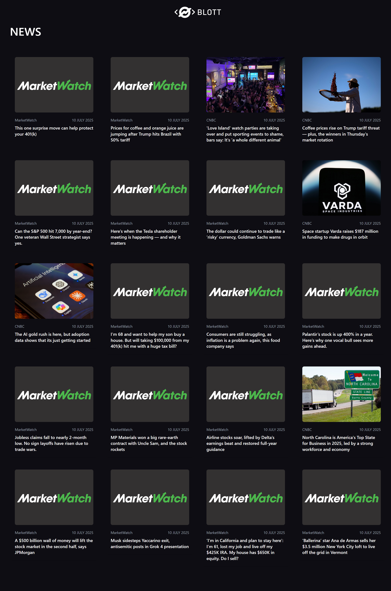

````markdown
# News Feed App

A responsive and interactive news feed web application built with **React** and **Tailwind CSS**, fetching live market news from the [Finnhub API](https://finnhub.io/docs/api/market-news).

## Preview



## Features
- Real-time market news from Finnhub
- Mobile-responsive layout
- Hover effects with smooth transitions
- Opens full news in a new tab
- Error handling for API failures
- Custom date formatting (e.g., `9 JUNE 2021`)

## Tech Stack
- **Frontend**: React, Tailwind CSS
- **Data**: [Finnhub Market News API](https://finnhub.io/docs/api/market-news)

## Getting Started

### 1. Clone the repository
```bash
git clone https://github.com/brainycodes/blott-news.git
cd blott-news
````

### 2. Install dependencies
```bash
npm install
```

### 3. Add your API key
Create a `.env` file in the root and add your Finnhub API key:

```
VITE_FINNHUB_API_KEY=your_api_key_here
```

Update the code to use it:
```js
const API_KEY = import.meta.env.VITE_FINNHUB_API_KEY;
```

### 4. Start the development server
```bash
npm run dev
```

## Folder Structure
```
src/
├── components/
│   └── Header.jsx
│   └── NewsCard.jsx
├── layouts/
│   └── MainLayout.jsx
├── pages/
│   └── News.jsx
├── utils/
│   └── cardMerge.js
│   └── formatDate.js
└── App.jsx
```

## API Reference
**Endpoint:**
```
https://finnhub.io/api/v1/news?category=general&token=YOUR_API_KEY
```

**Fields used:**
* `headline`
* `datetime` (converted to readable date)
* `source`
* `url` (opens in new tab)
* `image`

## License

MIT License — free to use, modify, and distribute.

## Author
**Solomon Zion**
Built with 💙 for learning, exploring APIs, and building clean UI with React.

## Feedback

Feel free to [open issues](https://github.com/brainycodes/blott-news/issues) or submit pull requests!

```
Let me know if:
- You want a version for GitHub Pages deployment
- You’re using Vite or Create React App and want different setup instructions
- You want to include loading/skeleton UI in this README too
```
